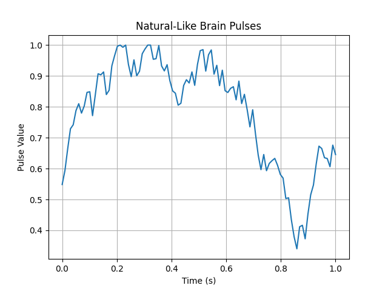

# Brain Pulse Simulator

This project simulates brain-like pulse data with realistic gradual transitions, then plots and exports them for use in neural-inspired applications.

## 📈 Example Output

## 🔧 How It Works

- Generates `n` pulses between 0 and 1.
- Each pulse differs slightly (±0.08) from the previous one to mimic real neural activity.
- Saves pulses to a `.json`-like file (one value per line).

## 📁 Output Files

- `simulated_brain_pulses.json`: Raw pulse values
- `pulse_plot.png`: Visualization of pulse waveform

## 🧠 Inspired By

Brain waves and biological signal behavior during rest, focus, and physical activity.
